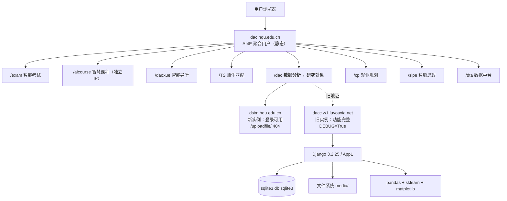

# 网站架构图

```mermaid
flowchart TB
  U["用户浏览器"] --> P["dac.hqu.edu.cn<br/>AI4E 聚合门户（静态）"]
  P --> S1["/exam 智能考试"]
  P --> S2["/aicourse 智慧课程（独立IP）"]
  P --> S3["/daoxue 智能导学"]
  P --> S4["/TS 师生匹配"]
  P --> S5["/dac <b>数据分析 ←研究对象</b>"]
  P --> S6["/cp 就业规划"]
  P --> S7["/sipe 智能思政"]
  P --> S8["/dta 数据中台"]

  S5 --> N["dsim.hqu.edu.cn<br/>新实例：登录可用<br/>/uploadfile/ 404"]
  S5 -.旧地址.-> O["dacc.w1.luyouxia.net<br/>旧实例：功能完整<br/>DEBUG=True"]

  O --> D["Django 3.2.25 / App1"]
  D --> DB[("sqlite3 db.sqlite3")]
  D --> FS["文件系统 media/"]
  D --> AL["pandas + sklearn + matplotlib"]
```
