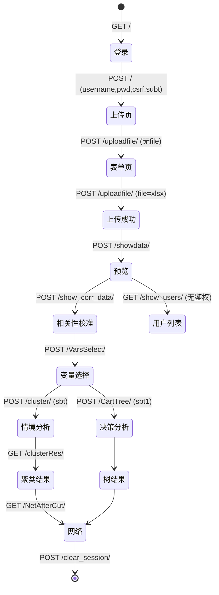

# DAC 页面路由图

```mermaid
stateDiagram-v2
  [*] --> 登录: GET /
  登录 --> 上传页: POST / (username,pwd,csrf,subt)
  上传页 --> 表单页: POST /uploadfile/ (无file)
  表单页 --> 上传成功: POST /uploadfile/ (file=xlsx)
  上传成功 --> 预览: POST /showdata/
  预览 --> 相关性校准: POST /show_corr_data/
  相关性校准 --> 变量选择: POST /VarsSelect/
  变量选择 --> 情境分析: POST /cluster/ (sbt)
  变量选择 --> 决策分析: POST /CartTree/ (sbt1)
  情境分析 --> 聚类结果: GET /clusterRes/
  决策分析 --> 树结果
  聚类结果 --> 网络: GET /NetAfterCut/
  树结果 --> 网络
  网络 --> [*]: POST /clear_session/
  预览 --> 用户列表: GET /show_users/ (无鉴权)
```
