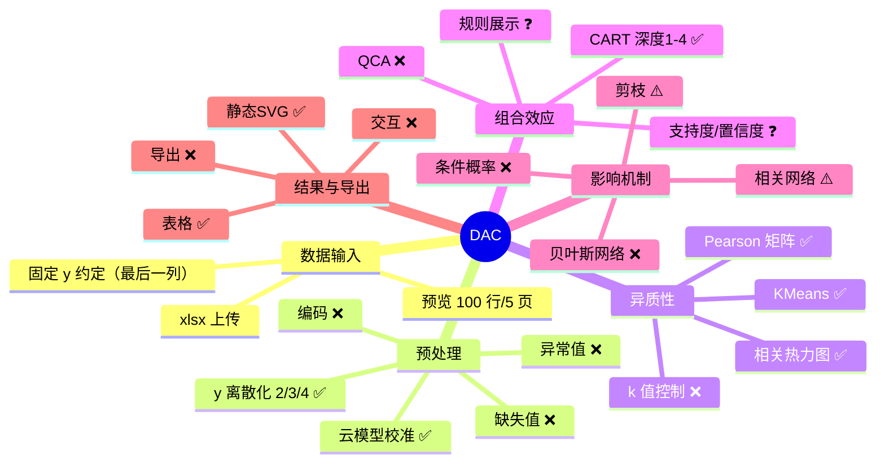

# DAC 功能结构图

```mermaid
mindmap
  root((DAC))
    数据输入
      xlsx 上传
      固定 y 约定（最后一列）
      预览 100 行/5 页
    预处理
      云模型校准 ✅
      y 离散化 2/3/4 ✅
      缺失值 ❌
      异常值 ❌
      编码 ❌
    异质性
      Pearson 矩阵 ✅
      相关热力图 ✅
      KMeans ✅
      k 值控制 ❌
    组合效应
      CART 深度1-4 ✅
      规则展示 ❓
      支持度/置信度 ❓
      QCA ❌
    影响机制
      相关网络 ⚠️
      剪枝 ⚠️
      贝叶斯网络 ❌
      条件概率 ❌
    结果与导出
      表格 ✅
      静态SVG ✅
      交互 ❌
      导出 ❌
```
