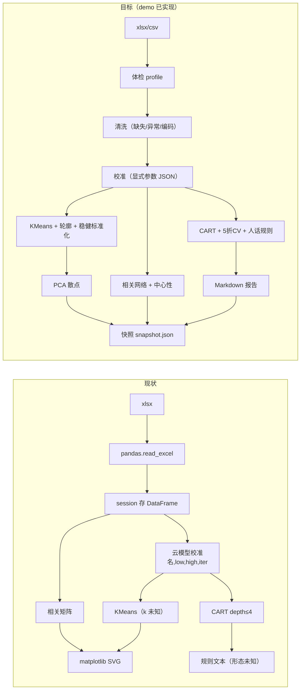

# 数据处理流程图（现状 vs 目标）

```mermaid
flowchart LR
  subgraph 现状
    A1["xlsx"] --> A2["pandas.read_excel"]
    A2 --> A3["session 存 DataFrame"]
    A3 --> A4["相关矩阵"]
    A3 --> A5["云模型校准<br/>名,low,high,iter"]
    A5 --> A6["KMeans（k 未知）"]
    A5 --> A7["CART depth≤4"]
    A4 --> A8["matplotlib SVG"]
    A6 --> A8
    A7 --> A9["规则文本（形态未知）"]
  end
  subgraph 目标["目标（demo 已实现）"]
    B1["xlsx/csv"] --> B2["体检 profile"]
    B2 --> B3["清洗（缺失/异常/编码）"]
    B3 --> B4["校准（显式参数 JSON）"]
    B4 --> B5["KMeans + 轮廓 + 稳健标准化"]
    B4 --> B6["CART + 5折CV + 人话规则"]
    B5 --> B7["PCA 散点"]
    B4 --> B8["相关网络 + 中心性"]
    B6 --> B9["Markdown 报告"]
    B7 --> B10["快照 snapshot.json"]
    B8 --> B10
    B9 --> B10
  end
```
