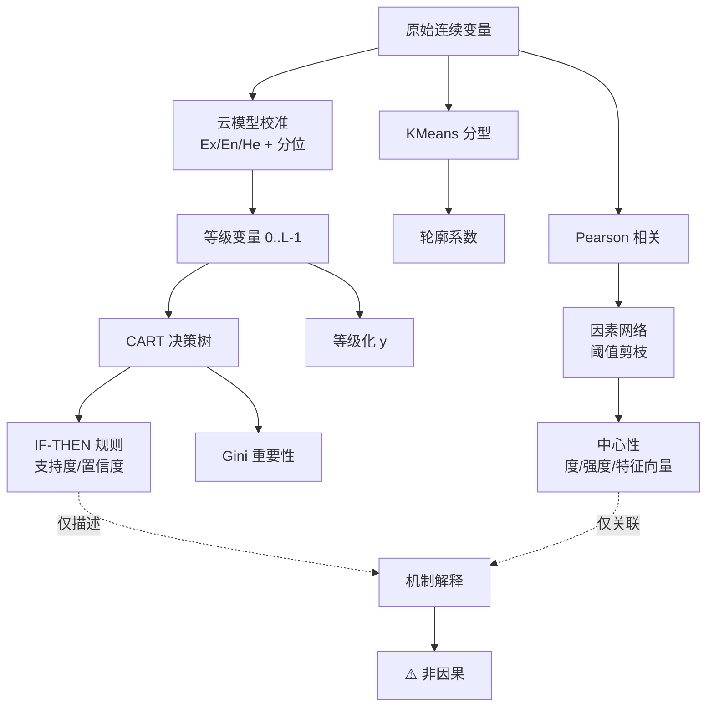

# 算法关系图

```mermaid
flowchart TD
  X["原始连续变量"] --> C["云模型校准<br/>Ex/En/He + 分位"]
  C --> L["等级变量 0..L-1"]
  L --> T["CART 决策树"]
  L --> S["等级化 y"]
  T --> R["IF-THEN 规则<br/>支持度/置信度"]
  T --> I["Gini 重要性"]
  X --> K["KMeans 分型"]
  K --> SC["轮廓系数"]
  X --> P["Pearson 相关"]
  P --> N["因素网络<br/>阈值剪枝"]
  N --> CE["中心性<br/>度/强度/特征向量"]
  R -.仅描述.-> M["机制解释"]
  CE -.仅关联.-> M
  M --> W["⚠️ 非因果"]
```
