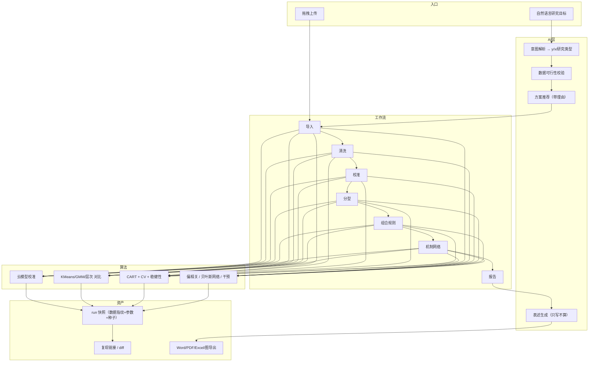

# 下一代产品创新架构

```mermaid
flowchart TB
  subgraph 入口
    I1["自然语言研究目标"]
    I2["拖拽上传"]
  end
  subgraph AI层
    A1["意图解析 → y/x/研究类型"]
    A2["数据可行性校验"]
    A3["方案推荐（带理由）"]
    A4["表述生成（只写不算）"]
  end
  subgraph 工作流
    W1["导入"] --> W2["清洗"] --> W3["校准"] --> W4["分型"] --> W5["组合规则"] --> W6["机制网络"] --> W7["报告"]
  end
  subgraph 算法
    C1["云模型校准"]
    C2["KMeans/GMM/层次 对比"]
    C3["CART + CV + 稳健性"]
    C4["偏相关 / 贝叶斯网络 / 干预"]
  end
  subgraph 资产
    R1["run 快照（数据指纹+参数+种子）"]
    R2["复现链接 / diff"]
    R3["Word/PDF/Excel/图导出"]
  end
  I1 --> A1 --> A2 --> A3 --> W1
  I2 --> W1
  W1 & W2 & W3 & W4 & W5 & W6 --> C1 & C2 & C3 & C4
  C1 & C2 & C3 & C4 --> R1 --> R2
  W7 --> A4 --> R3
```
